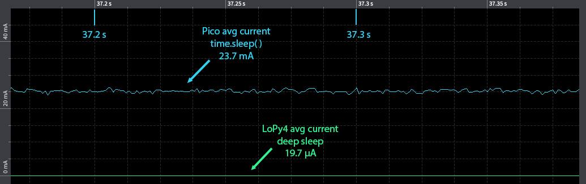

# Raspberry Pi Pico LoRaWAN with RAK811

The Raspberry Pi Pico, together with the RAK811, joining, sending, and receiving downlink(Only **int** implemented; for downlinks).  
Set the **DevEUI**, **AppEUI**, and **AppKey**  in `config.py`

For AT commands, error codes, and RAK811 information, see the [RAK811 Breakout Board AT Command Manual.](https://docs.rakwireless.com/Product-Categories/WisDuo/RAK811-Breakout-Board/AT-Command-Manual/#introduction)

The default setting is connected to UART0 on the pico, and the UART response timeout is set to 8 seconds. 

The Raspberry Pi Pico is not a good option to use with LoRaWAN if battery is the desired power source, and for most LoRaWAN devices, this is the case. The lowest average current consumption I could measure using MicroPython and the time.sleep(forever) was 23.7mA, no deep sleep available for the Pico and MicroPython. Compared with the measurements performed with the LoPy4 during deep_sleep(forever) 19.7µA.

In a use case where a 1200mAh battery is powering the Pico, the lifetime for the device would be around two days, vs. five years for the LoPy4. (Battery self-discharge has not been taken into consideration)

However, the Pico is a fun board, and hopefully, deep sleep possibilities are implemented in future boards.