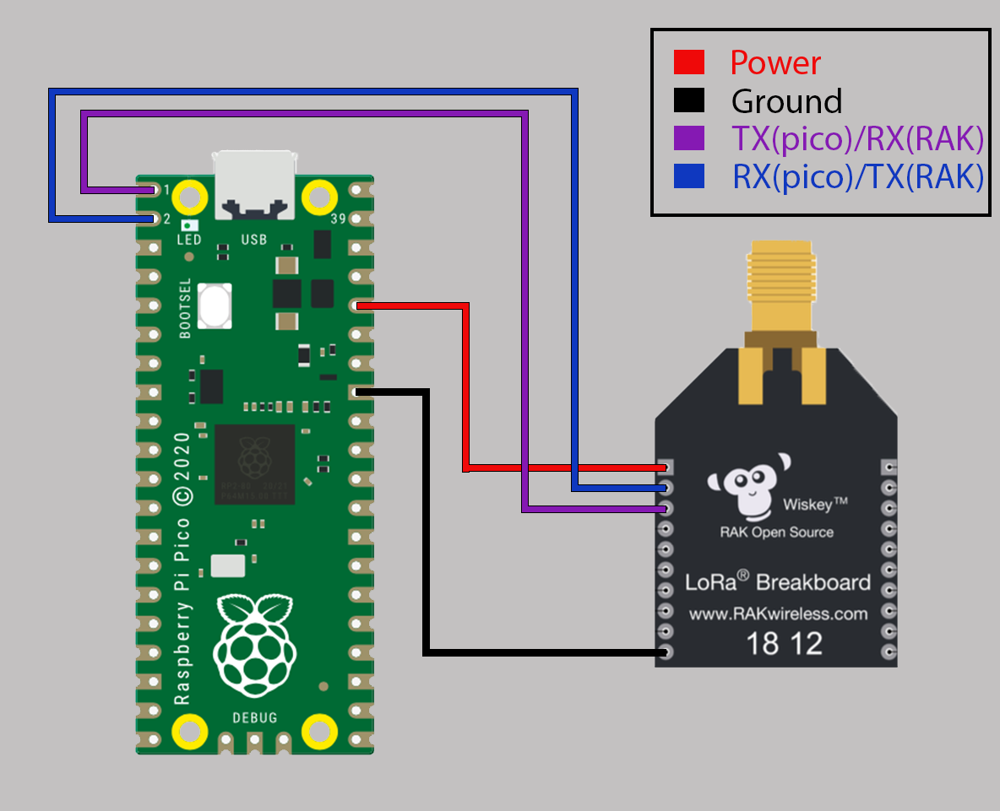

# Raspberry Pi Pico LoRaWAN with RAK811

The Raspberry Pi Pico, together with the RAK811, joining, sending, and receiving downlink(Only **int** implemented; for downlinks).  
Set the **DevEUI**, **AppEUI**, and **AppKey**  in `config.py`

For AT commands, error codes, and RAK811 information, see the [RAK811 Breakout Board AT Command Manual.](https://docs.rakwireless.com/Product-Categories/WisDuo/RAK811-Breakout-Board/AT-Command-Manual/#introduction)

The default setting is connected to UART1 on the pico, and the UART response timeout is set to 5 seconds. 

Using just MicroPython, the pico is not a suitable MCU to use in an IoT device with a LoRaWAN connection. However, if the sleep modes provided in the [pico-playground](https://github.com/raspberrypi/pico-playground/tree/master/sleep) are integrated, the pico can achieve sleep mode current down to 0.8mA with the dormant mode and 1.3mA with the sleep mode. If the Saft LS14500 battery is used with a battery capacity of 2600mAh, the pico can achieve an estimated battery lifetime of 2.1 months in sleep mode.

Implementation on the [Firebeetle ESP32](https://github.com/makjohansson/FireBeetleESP32_LoRaWAN)